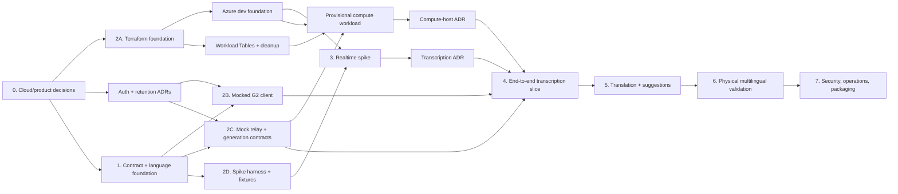

# Palancar implementation plan

Status: Implementation planning
Last updated: 2026-08-09
Review status: GPT-5.6 Sol `READY` for planning and corrected Phase 0 ADRs

Review loop summary:

- Planning pass defined the package boundaries, Terraform stacks, dependency graph, and parallel lanes.
- Adversarial review initially returned `NEEDS WORK` for authentication ordering, mixed-language evidence, protocol recovery limits, G2 lifecycle/packaging, Terraform identity/image ordering, compute-host assumptions, and weak transcription sample sizes.
- The fix passes moved authentication/retention before real audio, reject mixed turns in v1, completed protocol limits and replay semantics, split image-pull/runtime identities, added provisional compute and provider gates, and aligned statistically sized physical-G2 evidence across both product and implementation plans.
- The original planning re-review returned `READY`; the Phase 0 ADRs then closed
  all first-pass and re-review findings and received a final Sol `READY`.

## Outcome

Build Palancar as an npm-workspace TypeScript monorepo with four independently testable boundaries:

1. A versioned protocol and target-language registry shared by every runtime.
2. A G2 WebView client that owns Even SDK lifecycle, microphone capture, bounded audio transport, interaction state, and serialized display updates.
3. An authenticated Azure relay that owns session state, resampling, transcription-provider connections, language gating, translation, and response suggestions.
4. Terraform stacks that bootstrap state and provision a reproducible Azure development environment without putting reusable Azure credentials in the G2 bundle.

The first supported wearer language is English. The target language is selected per session from Spanish (`es`) or Turkish (`tr`). Core code is registry-driven; neither language receives a special branch outside its registry data and conformance fixtures.

The production transcription adapter is deliberately undecided until the Terraform-provisioned mini-transcribe deployment passes the realtime spike. Client, protocol, mocked relay, language gate, fixtures, and most infrastructure can be built in parallel without waiting for that result.

## Recommended technology baseline

- Workspace and runtime: npm workspaces, Node.js 22, strict TypeScript, committed `package-lock.json`.
- G2 client: Vite, Vitest, `@evenrealities/even_hub_sdk` exactly `0.0.12`.
- Relay: Fastify, `ws`, runtime schema validation with TypeBox and Ajv, structured logging, and OpenTelemetry-compatible instrumentation.
- Azure compute candidate: Azure Container Apps, initially one warm replica and one active revision, subject to a decisive WebSocket/session-longevity ADR before workload promotion/selection.
- Container build: Docker with pinned base-image digest and a production build containing only runtime dependencies.
- Transcription: a provider interface with Azure Realtime and Azure Speech adapters; only the spike winner becomes active in production configuration.
- Audio normalization: a provider capability. The Azure Realtime adapter owns one stateful, production-quality 16 kHz to 24 kHz resampler per active utterance; a provider that accepts native 16 kHz bypasses it. Select and pin the concrete native or WASM implementation only after continuity, image-build, and accuracy tests.
- Translation and suggestions: separate typed operations against the requested Foundry Luna deployment so English translation can appear without waiting for suggestion generation.
- IaC: Terraform with pinned AzureRM and AzAPI providers. Prefer AzureRM resources; use AzAPI only where current Foundry functionality is not represented by AzureRM.

The repository requires npm rather than pnpm because the established G2 toolchain commits `package-lock.json` and uses npm commands.

## End-to-end component flow

```text
G2/R1 input
   |
   v
apps/g2-client
   |  authenticated WSS: protocol-v1 JSON + binary PCM16
   v
apps/relay
   +--> packages/audio: offsets, queue policy, adapter-required resampling
   +--> packages/transcription: Azure Realtime or Azure Speech adapter
   +--> packages/language-registry: selected-target gate (es or tr)
           |
           +-- rejected: english, mixed, supported_unselected, unsupported, uncertain
           |
           +-- accepted final target turn
                    |
                    v
              packages/generation
                    +--> English translation
                    +--> 2-3 English + target-language responses
```

Only an accepted, authoritative final transcript can invoke translation or suggestions. Probable target-language partials can be displayed but never cross the generation boundary.

## Proposed repository structure

```text
palancar/
├── apps/
│   ├── g2-client/                   # Even bridge, state machine, audio sender, HUD
│   └── relay/                       # HTTP health, authenticated WSS, orchestration
├── packages/
│   ├── contracts/                   # protocol-v1 TypeBox schemas and fixtures
│   ├── language-registry/           # registry, classifier interface, gate policy
│   ├── audio/                       # framing, offsets, queues, resampler abstraction
│   ├── transcription/               # provider contract and Azure adapters
│   ├── generation/                  # Luna request/result schemas and service
│   ├── telemetry/                   # metric names, traces, redaction helpers
│   └── test-fixtures/               # PCM and es/tr/en transcript/audio corpora
├── tools/
│   ├── realtime-spike/              # timestamped append/VAD/commit experiments
│   └── protocol-replay/             # deterministic mock WSS and event replay
├── infra/
│   ├── bootstrap/                   # state storage and deployment identities
│   ├── modules/
│   │   ├── foundry/
│   │   ├── container-app/
│   │   ├── container-registry/
│   │   ├── identity-rbac/
│   │   ├── workload-state/          # SecurityState/RateState + Table RBAC
│   │   ├── expiry-cleanup-job/      # managed daily row cleanup
│   │   ├── observability/
│   │   ├── key-vault/               # optional; only unavoidable secrets
│   │   ├── networking/              # optional private-networking controls
│   │   └── budget/
│   └── environments/
│       └── dev/
├── docs/
│   ├── adr/
│   │   ├── 0000-language-registry.md
│   │   ├── 0001-protocol-v1.md
│   │   ├── 0002-transcription-mode.md
│   │   ├── 0003-client-authentication.md
│   │   ├── 0004-data-retention.md
│   │   └── 0005-compute-host.md
│   ├── evidence/                    # redacted auth/compute + metadata-only spike/hardware reports
│   ├── implementation-plan.md
│   └── real-time-translation-plan.md
├── package.json
├── package-lock.json
└── tsconfig.base.json
```

## Code responsibilities

### Shared protocol

`packages/contracts` is the first merge gate. TypeBox schemas are the single source for runtime validation and inferred TypeScript types; generated artifacts are limited to formats that an external consumer actually needs.

- `session.start`, `session.resume`, `session.ready`, `session.rejected`, and
  `session.end`.
- Idempotent `utterance.start`, `utterance.commit`, `utterance.cancel`, and `utterance.aborted`.
- `audio.ack` with highest contiguous accepted 16 kHz sample offset and flow-control state.
- `transcript.partial` and `transcript.final` with stable segment ID and monotonically increasing revision.
- `language.decision` with `target`, `mixed`, `english`, `supported_unselected`, `unsupported`, or `uncertain`.
- `translation.ready`, `suggestions.ready`, and versioned error envelopes.

The first control message is exactly `session.start` for new intent or
`session.resume` for exact resume intent. Both carry `protocolVersion`,
`wearerLanguage`, explicitly confirmed `targetLanguage`, language-registry and
`gatePolicyVersion`, client build, and common limit negotiation. Only
`session.resume` carries session/utterance IDs and last-acknowledged,
oldest-retained, and next-captured offsets. Unknown versions or unsupported
targets are rejected before audio capture. `session.ready` may lower negotiable
limits but never advertises above the hard v1 maxima.

Binary frames use a documented fixed header containing protocol version, utterance identity, sequence number, absolute starting sample offset, payload length, and flags followed by PCM bytes. The exact byte layout is frozen in ADR 0001 and golden fixtures. Odd-byte payloads, overlaps, gaps, duplicates, stale utterances, and queue overflow are explicit protocol outcomes.

ADR 0001 must close these semantics before protocol v1 is frozen:

- Sample offsets count 16 kHz mono samples from utterance start; `audio.ack` returns the highest contiguous exclusive offset accepted.
- Protocol v1 limits are 3,200 PCM bytes per frame, 16,384 UTF-8 bytes per
  control message, 8,000 unacknowledged samples/500 ms, one active utterance per
  session, a 30-second utterance, a 30-minute session, and a 5-minute
  user-inactivity timeout. ADR 0001 is authoritative.
- The client retains unacknowledged frames within the negotiated replay window. The server advertises maximum frame size, in-flight samples, ACK cadence, and session limits in `session.ready`.
- ACKs are emitted at least every 100 ms of accepted audio and whenever flow-control state changes.
- Reconnect uses `session.resume`. A requested offset is valid in the inclusive
  range `[oldestRetainedOffset, nextCapturedOffset]`; the client replays
  `[requestedOffset, nextCapturedOffset)`, which may be empty. Otherwise both
  sides visibly abort the utterance.
- Versioned error/close codes cover malformed size, unsupported version, integer overflow, gap, overlap, stale turn, flow-control violation, authentication expiry, and non-resumable reconnect.

The relay also persists a per-installation/session original-sample token bucket
in `RateState`: refill 16,000 samples/second, capacity 8,000, charge only first
acceptance and not exact duplicate replay. Its ETag update succeeds before
provider forwarding; state outage fails closed. First overrun aborts the turn,
and repeated/deliberate overrun closes `4408`. This is independent of the 8,000
unacknowledged-sample limit.

Golden and fuzz tests cover maximum/minimum lengths, integer boundaries, floods, duplicate/out-of-order frames, retained-window replay, and abort when the requested server offset is older than retained audio.

### Authentication and session ticket

ADR 0003 is a prerequisite to client and relay lane implementation. A browser WebSocket cannot attach an arbitrary `Authorization` header, so Palancar uses a two-step contract:

1. The WebView enrolls once with an operator-issued, high-entropy, one-time
   pairing code. Input accepts only the canonical 26-character Crockford Base32
   representation and rejects aliases/noncanonical forms before hashing; the
   resulting revocable per-installation credential is stored in IndexedDB.
2. The WebView authenticates HTTPS `POST /v1/session-tickets` with that bearer credential. The relay returns an opaque, audience-bound, single-use ticket with an exact 60-second lifetime.
3. The client opens `wss://<relay>/v1/stream` and offers `palancar.v1` plus `palancar.ticket.<ticket>` in `Sec-WebSocket-Protocol`. Query-string tickets are prohibited in protocol v1.
4. Before HTTP 101, the relay atomically consumes the ticket in Azure Table Storage, rejects reuse/expiry/wrong audience or credential version, and returns only `palancar.v1` as the selected protocol.

Pre-upgrade authentication/audience/replay, origin, rate, conflict, and state
failures use generic HTTP `401`/`403`/`409`/`429`/`503` responses. Custom `44xx`
codes apply only after upgrade or in an explicitly approved first-message
fallback. Source-IP controls use a per-host trusted-source adapter over only
platform-controlled peer/forwarded data and never an arbitrary client
`X-Forwarded-For` chain; each compute host must revalidate that adapter.

ADR 0003 is authoritative for enrollment, IndexedDB storage, rotation/revocation, state-store atomicity, fallback ordering, a possible `null` WebView origin, and ticket redaction across candidate-host access logs, Application Insights, structured logs, exception/error payloads, client diagnostics, and browser-visible history. A same-origin secure HttpOnly cookie or strictly limited first-message flow is considered only if physical-host evidence rejects subprotocol transport; a URL ticket is not a fallback.

Development authentication is now decided. Production migrates operator pairing to an approved Entra External ID or equivalent authorization-code-plus-PKCE flow while preserving installation registration and single-use tickets. Baseline authentication, replay protection, per-installation/session rate limits, maximum session duration, raw-audio non-retention, and zero application conversation retention must be operational before Phase 4 sends real conversation audio. Phase 7 hardens and productionizes those controls rather than introducing them for the first time.

### Target-language registry and gate

`packages/language-registry` exposes generic interfaces rather than language branches:

```ts
type TargetLanguage = 'es' | 'tr'

interface LanguageDefinition {
  code: TargetLanguage
  displayName: string
  transcriptionHint?: string
  confidenceThreshold: number
  mixedPolicy: 'reject'
  fixtureSuiteIds: string[]
}

interface LanguageEvidence {
  detectedLanguage?: string
  confidence?: number
  text: string
  detectorVersion: string
  source: 'transcription-metadata' | 'text-classifier'
}

type GateDecision =
  | 'target'
  | 'mixed'
  | 'english'
  | 'supported_unselected'
  | 'unsupported'
  | 'uncertain'
```

The classifier is an adapter because the selected realtime transcription contract might not provide reliable detected-language confidence. Candidate text-language detectors must be evaluated on the committed English, Spanish, Turkish, short-utterance, named-entity, and code-switch fixtures before one is pinned.

The spike compares automatic-language transcription with `language: es` and `language: tr` configurations. Microsoft documents that supplying an input language can improve accuracy and latency, but a hint is advisory for Palancar: it cannot authorize a turn and must be disabled if it raises English or unselected-language false acceptance.

Gate rules:

- Only a final `target` decision may call generation in the first release.
- `english`, `mixed`, `supported_unselected`, `unsupported`, and `uncertain`
  decisions make zero generation calls.
- Spanish-selected sessions must reject Turkish fixtures; Turkish-selected sessions must reject Spanish fixtures.
- Thresholds and mixed rejection policy are versioned per registry entry and observable in metrics. A future mixed-language mode requires calibrated per-language spans or probabilities and its own ADR before it can cross the generation boundary.
- Client display copy is derived from the selected registry entry, such as `Waiting for Turkish`, rather than hard-coded conditionals.

### G2 client

`apps/g2-client` owns:

- `waitForEvenAppBridge()` initialization and exactly one `createStartUpPageContainer()` call per WebView lifetime. Failure enters an error state without retrying that one-shot call.
- Typed routing of R1/temple press, `CLICK_EVENT` together with normalized `undefined`, double-press exit, lifecycle, device status, and `audioEvent.audioPcm`.
- A state machine for Starting, TargetSelection, Ready, Listening, Finalizing,
  Translating, Results, Recovering, and Error. Starting restores the last target
  only as highlighted; TargetSelection says “press to confirm, swipe to change”
  and confirmation precedes session start or microphone access. Results uses
  swipe to cycle and press to start the next turn.
- Chunk-agnostic PCM handling, sample alignment, a 500 ms bounded queue, binary framing, acknowledgements, and visible utterance abort on overflow.
- Eager persistence of selected target language and safe session preferences.
- A single latest-wins display queue with 150–200 ms transcript scheduling and serialized `textContainerUpgrade()` calls.
- Reconnection that either resumes from an explicitly confirmed offset or aborts the current utterance; no silent continuation.
- `audioControl(false)`, retained unsubscribe callbacks, timer/socket cleanup, and cleanup after `SYSTEM_EXIT_EVENT` or `ABNORMAL_EXIT_EVENT`.
- Root double-press through `shutDownPageContainer(1)` without premature teardown, because the wearer can cancel the system confirmation.

`apps/g2-client/app.json` and `apps/g2-client/public/` own the manifest and packaging assets. The initial manifest uses package ID `com.palancar.translate`, name `Palancar`, version `0.1.0`, edition `202601`, `min_app_version: "2.0.0"`, `min_sdk_version: "0.0.12"`, a real `dist/index.html` entrypoint, and `supported_languages: ["en"]` for the English app UI. It declares only `network` and `g2-microphone`, each with a non-empty user-facing description. Its network whitelist is generated from a reviewed non-secret relay-origin artifact and validated before packaging. Project dependencies pin `@evenrealities/evenhub-cli` exactly `0.1.13` and simulator `0.8.0` alongside SDK `0.0.12`.

The G2 lane cannot exit until `npm run build` succeeds, `dist/index.html` matches the manifest, `npx evenhub pack app.json dist -o palancar.ehpk` succeeds from the client package, and the package is checked for secrets, `.env` files, and unintended source maps.

It depends only on protocol contracts and a transport interface, so it can be implemented against `tools/protocol-replay` before Azure exists.

### Relay

`apps/relay` owns:

- Health/readiness endpoints and an authenticated WebSocket upgrade.
- Short-lived session authorization, limits, heartbeats, and protocol validation.
- One in-memory session owner per active WebSocket, with explicit behavior when a replica or connection disappears.
- Ordered frame acceptance, contiguous-offset acknowledgements, backpressure, utterance cancellation, and stale-event protection.
- One transcription connection and stateful resampler per active listening session/utterance as required by the selected adapter.
- Provisional/final revision handling and the authoritative language-gate decision.
- Independent translation and suggestion operations after gate acceptance.
- Allow-listed telemetry that excludes raw audio and all conversation content in
  every deployed mode, log level, trace, exception, diagnostic/evidence sink,
  and crash report.

The development Container App remains at one replica so an active in-memory session cannot be split. Production horizontal scaling and cross-replica recovery are deferred until connection counts require them; a dropped replica aborts its active turns visibly.

### Transcription spike and adapters

`packages/transcription` defines a provider-neutral session interface with `pushAudio`, `finalize`, `cancel`, normalized provisional/final events, and declared provider capabilities. Input sample rate, resampling, VAD, and commit cadence belong to adapter capabilities rather than the common contract: Azure Realtime may require stateful 16→24 kHz normalization, while another provider can consume native 16 kHz. `tools/realtime-spike` uses the same interface and writes metadata-only timestamped JSONL evidence. Allowed fields are event type, timestamp, opaque IDs, byte/sample/token counts, status, configuration/model versions, latency, and aggregate accuracy/gate results. PCM, transcript text, translation text, suggestions, prompts/responses, and provider payload bodies are categorically excluded.

The spike must cover, separately for Spanish and Turkish:

- Five seconds of uninterrupted speech without manual commit.
- Server VAD as the only automatic segment owner.
- VAD disabled with 600, 800, 1,000, and 3,000 ms commits.
- Automatic language mode and selected-language hint mode.
- English, selected target, unselected target, mixed, silence, and noisy fixtures.
- Physical-G2 speech streamed directly for English, Spanish, Turkish, mixed
  speech, silence, accents, and agreed noise conditions—not only clean uploaded
  fixtures.
- An exploratory minimum of 30 trials per candidate cell, including boundaries inside words and phrases, followed by statistically sized confirmation of the winning mode.

Thirty trials narrow the candidate space but do not substantiate p95 or 98% gate claims. Confirmation uses at least 200 end-to-end trials per winning language/mode for latency with a reported confidence interval. Gate sample sizes use exact binomial bounds: for example, at least 150 English turns per selected-target configuration with zero false accepts are needed to support a 98% rejection target at approximately 95% confidence; failures require a larger sample and recalculated interval. Selected- and unselected-language acceptance/rejection cells use the same documented confidence method rather than a fixed convenient count.

Speech onset, backend event timestamps, WebView receipt, and visible physical-display change must share a synchronized measurement method. ADR 0002 records exact model/deployment version, SKU, region, capacity, fixture/hardware versions, and confidence calculations. It selects Azure Realtime mini-transcribe only if latency, finalization, accuracy, boundary stability, and gate false-accept criteria all pass for Spanish and Turkish. Failure of any gate triggers the same harness against Azure Speech continuous recognition.

Physical-G2 test speech is streamed and scored in memory, then discarded; the
spike creates no recording or audio evidence artifact from physical or user
speech. Any persistable audio fixture must be a generated synthetic
non-conversation fixture and remain explicitly distinct from physical/user
speech. Spike evidence is metadata-only under the allow-list above.

### Generation

`packages/generation` exposes two typed methods:

- `translate(finalAcceptedTurn)` returns the English translation.
- `suggestResponses(finalAcceptedTurn)` returns two or three concise `{ english, targetLanguage }` pairs.

Both requests include selected target language, accepted final revision, and bounded conversational context. They use strict runtime validation and small output budgets. Translation and suggestions emit independent protocol events and have independent timeout/retry behavior. Neither operation is available to provisional or rejected turns.

## Terraform and Azure plan

### Bootstrap stack

`infra/bootstrap` creates:

- A dedicated resource group for Terraform state.
- A globally unique Storage Account with blob encryption, minimum TLS 1.2, shared-key access disabled after Entra backend verification, blob versioning, and public-container access disabled.
- A private blob container for state using Azure Blob lease locking, with blob/container soft deletion and an initial 14-day recovery window.
- Least-privilege state access roles.
- Federated plan/apply identities after the CI provider and repository are selected.

The state backend cannot create itself. ADR/bootstrap documentation names the initial human/operator identity and required temporary permissions. That operator authenticates with Azure CLI/Entra ID, applies bootstrap from protected local state, writes a non-secret backend configuration artifact, and migrates with a reviewed `terraform init -migrate-state`. The backend uses Entra/OIDC authentication rather than a committed Storage access key. Migration is accepted only after `terraform state list`, a no-change plan, blob-version verification, and a documented restore exercise. Bootstrap and environment state use separate keys and permissions; `prevent_destroy` protects the state resource group, account, and container. The protected local bootstrap state is archived or destroyed only after recovery is proven.

Network access must match the selected CI runner: private endpoints/default-deny require a runner with private network reachability, while a hosted runner requires a documented public-endpoint firewall policy with Entra authorization. OIDC proves identity but does not bypass network controls. Commit `.terraform.lock.hcl` and non-secret backend configuration templates; ignore initialized directories, generated live backend files, plans containing state-derived values, and credentials.

### Development environment stack

The dev environment has two explicit applies. The foundation apply composes modules for:

- Resource group, normalized naming, tags, and region, followed immediately by
  the resource-group budget and spending/anomaly alerts; these must exist before
  model deployments or a warm workload.
- A dedicated workload-state Storage account/module, separate from Terraform
  state, with shared-key access disabled and `SecurityState` and `RateState`
  Tables.
- Azure Container Registry, a dedicated pre-created user-assigned image-pull identity, and its `AcrPull` assignment before any Container App exists.
- Log Analytics, Application Insights, diagnostic settings, latency/error/cost metrics, alerts, and dashboards.
- Azure Container Apps environment without the relay workload.
- A separate runtime identity with least-privilege Foundry inference access and
  Storage Table Data Contributor on the workload-state account. Application
  configuration names this identity's client ID; application code never
  requests tokens through the image-pull identity. Table RBAC is complete before
  workload readiness.
- A managed daily expiry-cleanup Container Apps Job for expired `SecurityState`
  and `RateState` rows.
- Foundry/Azure AI account, the mini-transcribe candidate deployment, and the
  requested Luna deployment, only after budget and alerts exist.
- Key Vault only for a credential that cannot use managed identity; the module stays disabled otherwise.
- Optional VNet, private endpoints, private DNS, custom domain, and managed certificate after networking and DNS decisions are made.

After a relay image is pushed, a provisional workload apply creates the candidate Container App with both identities assigned for their separate platform/runtime purposes, external HTTPS/WebSocket ingress, health probes, single revision mode, minimum one replica, development maximum one replica, explicit immutable image digest, and candidate heartbeat/session configuration. Container Apps `identitySettings` sets the ACR-pull identity lifecycle to `None` and the runtime identity to `Main`, so workload code cannot obtain an ACR-pull token. ADR 0005 verifies this negative control as well as successful runtime-identity access. If the candidate passes, the same resource is promoted as the dev workload; if it fails, it is destroyed and the immutable relay image is deployed to the next compute candidate.

Current Microsoft guidance supports Foundry resources and model deployments through AzureRM and AzAPI Terraform providers. AzureRM exclusively owns resource groups, Terraform-state Storage, the separate workload-state Storage account and Tables, ACR, identities/RBAC, Log Analytics/Application Insights, Key Vault, budgets, the supported Foundry account, and `azurerm_cognitive_deployment` resources. The pinned provider owns the cleanup Container Apps Job when it exposes every required property; otherwise AzAPI owns that entire Job resource. AzureRM owns the relay Container App only if the pinned provider exposes required `identitySettings`; otherwise AzAPI owns the entire Container App at a pinned `Microsoft.App/containerApps` API version while AzureRM continues to own its environment and dependencies. AzAPI can also own a named Foundry project/capability gap. Providers never overlap ownership of one resource or its properties. Model name, model version, deployment SKU, and capacity remain variables because availability and quota are subscription/region dependent. [Terraform Foundry guidance](https://learn.microsoft.com/en-us/azure/ai-services/create-account-terraform), [Container Apps identity lifecycle](https://learn.microsoft.com/en-us/azure/container-apps/managed-identity)

Azure Container Apps supports WebSockets and managed identity, but it remains a candidate until ADR 0005 passes. The default HTTP ingress documentation lists a 240-second request timeout; heartbeats alone do not prove how an upgraded WebSocket behaves. The protocol matrix runs active v1 sessions to expected termination at 30 minutes, accepts no new turn at or after 29:30, and permits no unexplained close or audio gap. A heartbeat-only v1 session must close at five minutes with `4408`. Platform longevity is measured separately with a 35-minute synthetic transport probe that is explicitly not protocol v1 and is exempt from product inactivity/session enforcement. The gate also tests trusted-source mapping, state transactions/outage, concurrent-session limits, replica restart, single-revision rollout, graceful termination, reconnect/visible-abort behavior, warm latency, and cost with one minimum replica. If any required behavior fails, the same relay image and full host-specific matrix are tested on App Service or another documented candidate before compute is selected. [Container Apps ingress](https://learn.microsoft.com/en-us/azure/container-apps/ingress-overview), [managed identity and image pull](https://learn.microsoft.com/en-us/azure/container-apps/managed-identity-image-pull)

Azure Storage provides encrypted remote state and blob-lease locking. CI should use workload identity federation instead of a stored client secret once its provider is chosen. [Terraform state guidance](https://learn.microsoft.com/en-us/azure/developer/terraform/store-state-in-azure-storage)

### Image and deployment workflow

Terraform provisions ACR before the first relay image exists. The deployment sequence is:

1. Apply bootstrap.
2. Apply the dev foundation in dependency order: budget/alerts and observability;
   separate workload-state Storage with `SecurityState`/`RateState`; ACR;
   image-pull/runtime identities and ACR/Table RBAC; Container Apps environment;
   managed daily expiry-cleanup Job; then Foundry and model deployments.
3. Build, test, scan, and push the relay image with an immutable digest.
4. Provision a provisional candidate Container App workload with that digest and
   pre-created identities only after Table RBAC and state readiness pass.
5. Run ADR 0005 health, identity, 30-minute active-v1/five-minute inactive-v1
   enforcement, separate 35-minute transport longevity, restart, rollout,
   reconnect/abort, concurrency, and smoke checks.
6. Promote the passing candidate as dev, or destroy it and test the next compute host with the same digest.
7. Build the G2 package using the selected workload's `relay_origin` output for the Even network whitelist.

Terraform outputs include only non-secret integration values: relay origin, ACR server, workload Table endpoint/names, cleanup Job name, Foundry endpoint, deployment names, Key Vault URI when enabled, observability identifiers, and managed-identity IDs. Application builds consume an explicit reviewed output artifact; they do not parse arbitrary Terraform state.

## Dependency and phase graph



## Delivery phases

### Phase 0: decision and subscription preflight

Entry: implementation plan accepted.

Completed decisions and evidence:

- Subscription/tenant, East US 2, naming prefix, tags, and explicit development
  budget inputs are recorded; provider registration, candidate model availability,
  and quota were verified read-only.
- Operator pairing is the development enrollment flow, local Azure CLI identity
  is the development apply identity, and Azure-provided ingress is the initial
  endpoint.
- ADR 0003 freezes single-use subprotocol tickets, durable security/rate state,
  rotation/revocation, and pre-upgrade failures. ADR 0004 freezes unconditional
  zero application-content retention and the provider boundary.
- `TargetSelection`, start/commit, Results controls, 30-second utterance,
  30-minute session, five-minute inactivity, rate limits, and target persistence
  are decided.

Production CIAM, CI federation, custom DNS, and private networking are explicitly
deferred and do not block Terraform foundation or authenticated synthetic
implementation. Physical WebView origin, subprotocol forwarding, CORS,
IndexedDB, lifecycle, and packaging evidence moves to the Phase 4 pre-real-audio
entry gate. Phase 0 therefore exits without claiming that physical-host evidence
already exists.

### Phase 1: contract and language foundation

Work:

- Create npm workspace, strict TS configuration, lint/test/build commands, and dependency lock.
- Implement protocol-v1 schemas and all size/limit/ACK/reconnect semantics from ADR 0001, binary-frame fixtures, target-language registry, classifier interface, deterministic mixed rejection, and mock events.
- Add symmetric English/Spanish/Turkish conformance fixtures.

Exit evidence:

- Both selected targets accept their own final fixtures and reject English and the other target.
- Partial events cannot call generation by construction and test.
- Single-source schemas, external artifacts, and golden binary fixtures are reproducible.
- Malformed-size, integer-boundary, flood, replay-window, and non-resumable reconnect tests pass.

### Phase 2: four parallel construction lanes

The lanes have different entry gates. Infrastructure foundation starts as soon as Phase 0 cloud inputs are known and does not wait for protocol v1. Fixture/report tooling starts after the language-registry contract, while its provider integration waits for the provider-neutral transcription contract. G2 client and relay implementation wait for Phase 0 authentication/interaction/retention decisions and Phase 1 protocol freeze. Once those gates are met, all four lanes can proceed concurrently:

- 2A Infrastructure: bootstrap state; budgets/alerts; observability; dedicated
  workload-state Storage with `SecurityState`/`RateState`; ACR; separate
  pre-created image-pull/runtime identities and ACR/Table RBAC; Container Apps
  environment; managed daily expiry-cleanup Job; then Foundry deployments. A
  provisional workload is deployed after an immutable relay image exists and
  state/RBAC readiness passes, then ADR 0005 selects or rejects that host.
- 2B G2 client: bridge lifecycle, input state machine, mocked audio sender, target selector, display scheduler, recovery, and simulator automation.
- 2C Relay skeleton: authenticated WSS, protocol validation, mock transcription provider, acknowledgements, queue policy, language gate, and mock generation.
- 2D Evidence tooling: generated synthetic non-conversation PCM fixtures,
  language fixtures, realtime spike harness, metadata-only timestamp schema and
  report generator, and protocol replay.

Exit evidence: each lane passes its local contract suite; no lane changes protocol v1 unilaterally.

### Phase 3: realtime transcription selection

Entry: candidate Azure deployment and spike harness available.

Work: run exploratory append/VAD/commit and auto/hinted-language experiments for Spanish and Turkish, narrow candidates, then run statistically sized confirmation by streaming and scoring physical-G2 speech in memory with synchronized physical-display measurements and discarding the speech immediately afterward.

Exit evidence: ADR 0002 selects mini-transcribe or Azure Speech from measured p50/p95 latency with confidence intervals, accuracy, boundary stability, and exact-binomial gate error rates. A failed mini-transcribe result is a valid phase outcome. ADR 0005 separately selects the compute host from WebSocket/session evidence.

### Phase 4: end-to-end transcription vertical slice

Entry: physical Even WebView origin, IndexedDB persistence, CORS/lifecycle,
subprotocol forwarding, packaging, canary redaction, and provider data-handling
evidence pass before any real conversation audio. These checks do not block the
earlier Terraform foundation or authenticated synthetic implementation.

Work:

- Enforce baseline identity, single-use session tickets, replay/rate/session limits, and approved retention before accepting real audio.
- Integrate the selected adapter and stateful resampler into the relay.
- Connect physical G2 audio through acknowledgements and backpressure to Azure.
- Display partials; finalize and gate selected-language turns.
- Prove rejected English and unselected-language turns make zero generation calls.

Exit evidence: physical G2 useful partial under 1.5 seconds p95, final under 1.2 seconds p95 after stop/end, no silent audio gaps, and symmetric gate thresholds met.

### Phase 5: translation and response suggestions

Work: integrate managed-identity Luna access, strict schemas, independent translation/suggestion events, target-language response checks, phrase limits, timeouts, and cost telemetry.

Exit evidence: English translation arrives independently; two or three validated responses use the selected target language; malformed or late results cannot overwrite a newer turn.

### Phase 6: physical multilingual validation

Work: test English/Spanish/Turkish speakers, agreed accents, code-switching, noise, R1 and temple events, display fit, BLE cadence, foreground recovery, and private `.ehpk` installation.

Exit evidence: recorded hardware/firmware/app versions, latency and gate reports, simulator and physical screenshots, and no unresolved release-critical failures.

### Phase 7: security and operational hardening

Work: harden the already-operational authentication, rate/session limits, cost controls, and retention enforcement; add production alerts, dashboards, image rollback, infrastructure recovery, custom domain, CORS/whitelist verification, and release packaging.

Exit evidence: threat-model review, unauthorized-session tests, redacted logs, budget alerts, rollback exercise, reviewed Terraform plan, and production-equivalent package smoke.

## Parallel ownership and merge gates

| Lane | Initial write ownership | Can start | Runs alongside | Merge gate |
|---|---|---|---|---|
| Foundation owner | Root workspace files, `packages/contracts/**`, `packages/language-registry/**`, `packages/test-fixtures/**`, ADR 0000/0001 | Immediately; protocol after Phase 0 | Cloud preflight | Root changes serialized; protocol fixtures and symmetric es/tr tests |
| Architecture/security | ADR 0003/0004 and redacted auth/retention proof artifacts under `docs/evidence/**` | Phase 0 | Foundation and cloud preflight | Synthetic auth/state contracts and retention classification approved; physical WebView transport evidence at Phase 4 entry |
| G2 client | `apps/g2-client/**`, simulator tests/assets | Protocol v1, auth, and interactions frozen | Infra, relay, harness | Shared-schema compatibility, SDK constraints, simulator smoke |
| Relay | `apps/relay/**`, `packages/audio/**`, `packages/telemetry/**` | Protocol v1, auth, retention frozen | Client, infra, harness | Protocol, offset, queue, resampler, redaction tests |
| Transcription evidence | `packages/transcription/**`, `tools/realtime-spike/**`, metadata-only spike evidence, ADR 0002 | Provider contract frozen | Client, relay, infra | Metadata-only statistical report and ADR 0002 |
| Infrastructure | `infra/**`, non-secret output artifact/schema, ADR 0005 | Cloud inputs available | All code lanes | Budget/alerts before spend; separate workload state; Table RBAC before readiness; cleanup Job; `fmt`, `validate`, reviewed plans, compute gate, stable outputs |
| Generation | `packages/generation/**` | Generation schemas frozen | Client/relay mock work | Runtime-schema tests and gate-call audit |
| Protocol replay | `tools/protocol-replay/**` | Protocol v1 frozen | Client and relay | Deterministic journey and no console errors |
| Hardware QA | Metadata-only evidence artifacts; no physical/user speech recordings | Vertical slice available | Generation integration | Metadata-only physical latency and multilingual report |

Merge rules:

- No protocol change merges without schema snapshots/exported artifacts, golden fixtures, and client/relay/replay compatibility.
- No target-language registry change merges unless the same conformance suite runs for every enabled target.
- No Terraform output rename merges without validating every application-build consumer.
- No production transcription adapter merges before ADR 0002 records passing evidence.
- Parallel workers own disjoint paths; shared root configuration changes are serialized through the contract-foundation owner.

## Verification matrix

| Level | Required checks |
|---|---|
| Workspace | `npm ci`, lint, strict type-check, unit tests, production builds |
| Protocol | Runtime validation for every message; golden binary frames; version rejection; fuzzed lengths and offsets |
| Audio | Arbitrary callbacks, trailing byte, queue overflow, duplicate/gap handling, resampler continuity and reset |
| Language | Per target: at least 98% `english` rejection, 95% `target` acceptance, 95% `supported_unselected` rejection; deterministic `mixed` rejection |
| Client | Starting → TargetSelection → Ready confirmation before session/microphone; Results swipe-cycle/press-next; stale revisions, arbitrary PCM chunks, source-aware input, `CLICK_EVENT`/`undefined`, exact-once startup, cleanup, root mode-1 exit, serialized latest-wins display |
| Display | 576×288 bounds, container/type limits, unique IDs/names, exactly one capture target, text limits, z-order consistency |
| Simulator/package | Stable readiness marker, native HTTP automation, click/double-click journey, framebuffer regions, console errors, mocked partial/final/gate/result states, successful inspected `.ehpk` |
| Terraform | `terraform fmt -check -recursive`, provider lock, `terraform validate`, static/security checks, reviewed saved plan |
| Azure | Identity-only inference; active v1 termination at 30 minutes/no new turn at 29:30; heartbeat-only v1 `4408` at five minutes; separate exempt 35-minute transport probe; state/source/compute gates; statistically sized transcription trials; telemetry/cost records |
| Physical G2 | p95 latency, audio cadence, BLE display behavior, R1/temples, suspension/recovery, private `.ehpk` |
| Security | Generic pre-upgrade HTTP failures, unauthorized WSS rejection, expiry/replay, trusted-source mapping, fixed-window and 16,000-sample/second token-bucket races, no secrets or conversation content in any deployed sink |

## Phase 0 decision status

`docs/phase-0-decisions.md` records the completed development decisions for the subscription, East US 2 region, model candidates, naming direction, operator pairing, local Azure CLI apply identity, Azure-provided ingress, target confirmation, start/stop/results interaction, duration limits, retention, workload state, and provisional compute gate. ADRs 0001, 0003, 0004, and 0005 are authoritative for implementation and remain `NEEDS WORK` until the new Sol re-review.

The development cloud apply may proceed with local Azure CLI identity and Azure-provided ingress. CI federation, custom DNS, and private networking remain deliberately optional until a repository/zone and measured need exist. Every reviewed Terraform plan must set explicit budget thresholds and model capacity; no default silently spends the subscription credit.

## Deliberately deferred

- Automatic choice between Spanish and Turkish; the user selects one per session.
- Speaker diarization and simultaneous-speaker separation.
- General-purpose support for languages beyond registry entries.
- Cross-replica active-session migration.
- Long-term conversation memory.
- Voice output; G2 has no speaker.
- Polished suggestion browsing and tone presets beyond a minimal selectable result.
- Production private networking until regional compatibility and cost are decided.

## First implementation increment

Create one reviewable, cloud-independent language-foundation change containing:

- Root npm workspace and strict TypeScript/test configuration.
- `packages/language-registry` with equal `es` and `tr` entries, classifier/gate interfaces, and gate implementation.
- `packages/test-fixtures` with small licensed/synthetic finalized-text fixtures and controlled labeled `LanguageEvidence` for English, Spanish, Turkish, and mixed turns.
- Tests proving that each selected target accepts itself and rejects English, mixed turns, and the other target.
- ADR 0000 defining registry extension and symmetric-conformance rules.

This increment tests deterministic gate policy from controlled evidence; it does not claim production language-detector accuracy. Detector selection and measured accuracy belong to the later physical-G2 transcription spike.

Completion commands:

```text
npm ci
npm run lint
npm run typecheck
npm test
npm run build
```

This increment proves the two-language gate without prejudging transcription behavior. Cloud preflight/bootstrap design proceeds independently. Phase 0 authentication, interaction, duration, and retention decisions are complete; after this correction pass receives Sol re-review, the next code increment may freeze ADR 0001 into `packages/contracts` and unlock the authenticated synthetic G2 client, relay, and replay lanes.
